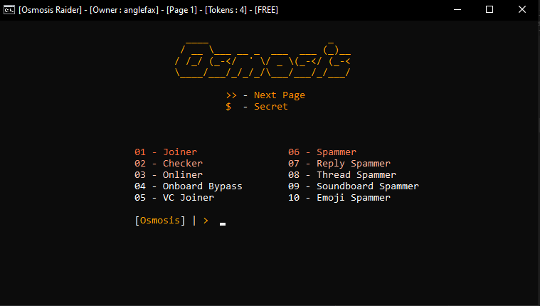

# Osmosis-Raider

**Allow me to introduce a solution engineered with precision — a Discord raider that redefines the standard for performance, reliability, and execution. Designed for users who require more than just noise, this tool operates with strategic efficiency, leveraging multithreaded architecture, randomized string injection, and adaptive message delivery to bypass conventional filters and deliver consistent, high-impact results.**

**What sets this product apart is not merely its capability, but its resilience — it withstands throttling, sidesteps detection, and continues to perform under conditions where others fail. Whether deployed for testing, demonstration, or controlled operations, this tool ensures maximum disruption with minimal friction.**

**A free version is available, offering robust functionality out of the box. For advanced users seeking full control and customization, the premium tier unlocks extended features, faster execution, and total dominance over message flow and behavior.**

# Other Information
**Share and star this repository, i'll release source @ 700 stars**
